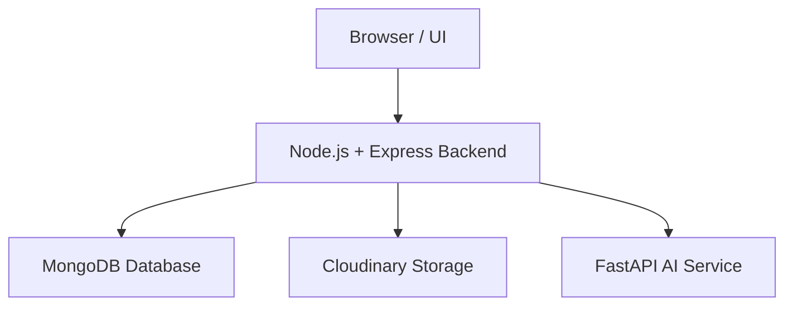

# SmartAttend – Intelligent Facial Recognition Attendance System

[](https://www.python.org/)
[](https://nodejs.org/)
[](https://www.mongodb.com/)
[](LICENSE)

---

## 📝 Project Overview

**SmartAttend** is a real-world attendance management system that leverages **facial recognition** to automate attendance tracking. It integrates **Node.js** backend, **MongoDB** database, **Cloudinary** for image storage, and a **FastAPI AI microservice** for face encoding and recognition.

**Key Features:**

- User registration and login with **JWT authentication**
- Admin and user role-based access control
- Upload multiple user photos for encoding
- Automatic face recognition from group session photos
- Attendance percentage calculation
- Secure password hashing with **bcrypt**
- Cloud storage for all images (Cloudinary)
- Real-time face matching using **face_recognition** and **OpenCV**
- Dashboard for users and admins

---

## 🏛 Architecture



## Tech Stack
- **Backend:** Node.js, Express
- **Frontend:** EJS, HTML, CSS
- **Database:** MongoDB
- **AI / ML:** FastAPI, face_recognition, OpenCV
- **Cloud Storage:** Cloudinary
- **Authentication:** JWT, bcrypt

## Installation
1. Clone the repo:
   ```bash
   git clone https://github.com/yourusername/attendance-sys.git
   cd attendance-sys
2. Install dependencies:
   ``` bash
     npm install
     pip install -r requirements.txt


 3.Create .env file:
  ``` bash
    MONGO_URI=mongodb://localhost:27017/attendanceSys
    JWT_SECRET=your_jwt_secret
    CLOUDINARY_CLOUD_NAME=...
    CLOUDINARY_API_KEY=...
    CLOUDINARY_API_SECRET=...
```
 4. Run the servers:
``` bash
node server.js
uvicorn ai_service:app --reload


```

## Project Structure
```
attendance_Sys/
│
├── src/
│   ├── config/
│   ├── models/
│   ├── middlewares/
│   ├── services/
│   ├── views/
│   └── app.js
│
├── public/
├── server.js
├── face_service.py
├── requirements.txt
├── .env
```

## 📷 Image Flow
## User Image Upload

- User uploads multiple photos
- Stored in Cloudinary
- URLs saved in MongoDB
- AI service extracts face encodings
- Average encoding stored per user
## Session Group Photo Upload
- Admin uploads group photo
- Stored in Cloudinary
- FastAPI detects faces
- Matches with stored encodings
- Attendance updated automatically


## 🔒 Security Practices

- Password hashing using bcrypt
- JWT stored in HTTP-only cookies
- Role-based access control (User / Admin)
- Protected routes via middleware
- Admin privilege verification before role changes

## 👨‍💻 Author

Shreyansh Srivastava
AI | Backend 

